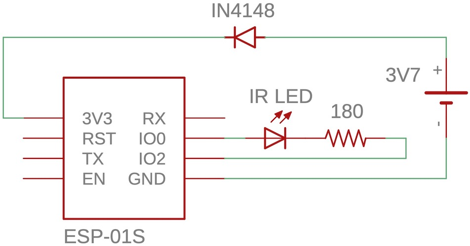

# ESP01-Beacon

Implements an IR beacon to emits bursts of a single character. The hardware is assumed to be an ESP8266-based ESP-01S module. Components are connected as shown below:

    

The carrier is generated on GPIO0 and is modulated by TX1 (UART1) on GPIO2. The default configuration uses a 38 kHz carrier frequency and broadcasts a single character `U` (`0x55` or `0b01010101`) every 100 ms. 

In addition, the program monitors the input voltage and will enter deep sleep when the voltage drops below ~2.8 VDC. The battery will have to be recharged and reattached to reenable the beacon.

## Credits

This code was inspired by the high-accuracy square wave generator by James Swineson found here:
[https://gist.github.com/Jamesits/92394675c0fe786467b26f90e95d3904](https://gist.github.com/Jamesits/92394675c0fe786467b26f90e95d3904)
